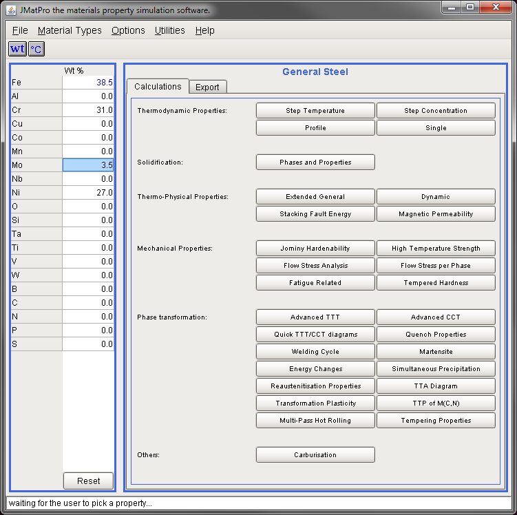
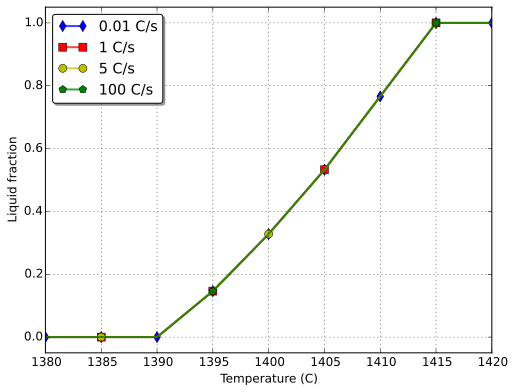

% JMatPro&reg; API with THERCAST&reg; 9.0
% Ali Saad
% Sept, 2015
<!-- https://guides.github.com/features/mastering-markdown/ -->
<!-- https://help.github.com/articles/markdown-basics/ -->

<!-- ------------------------------------------------------------------------------------- -->

# JMatPro&reg; software

## Introduction

From their website[^1], it is defined by:

JMatPro&reg; is a simulation software which calculates a wide range of materials properties 
for alloys and is particularly aimed at multi-components alloys used in industrial practice.

Using JMatPro&reg; you can make calculations for:

* Stable and metastable phase equilibrium
* Solidification behaviour and properties
* Mechanical properties
* Thermo-physical and physical properties
* Phase transformations
* Chemical properties

## Simulation data given by JMatPro&reg;

JMatPro&reg; databases give acces to (at a given composition or temperature):

1.  **Thermodynamic** data for each phase: *volume/mass fraction, composition, density, enthalpy ...*

1. **Thermophysical** data: *fraction, composition, density, enthalpy ...*

1. **Thermomechanical** data: *viscosity, surface tension, bulk and shear moduli ...*

1. **Electrical** data: *Electrical conductivity/resistivity ...*

<!-- ------------------------------------------------------------------------------------- -->

## Technical limitations and drawbacks

* Like any thermodynamic software, you should **know** what to **expect** :-)

* Software specificities: $\sigma$-phase precipitates are available in stainless steels but not in general steels (check $\chi$-phase)

* According to the product flyer, metastable phases are only available with Al alloys

* Other ? (For now it is not easy to know more, I need to dig in deeper ...)

# JMatPro&reg; GUI

## Intro

At TSV, it is only used via the interface (with only one machine-license)

## Intro (contd)

Several modules are available through the "Material Types" tab then choosing any material (**General Steel** in this case)

## Data validation

### Testing `Solidification` module with **General Steels**

The `Soldification`mdolule features a 0D computation[^1]

[^1]: assumed at a point
--------

## Limitations related to the GUI

1. Predefined exports: user is limited to available data exports, therefore no possibility to readily customize output

1. Input parameters may change for the same module if the material changes, with no documentation of the models using them:
    + Input parameters for **General** steels in `Solidification` are: 
    	grain size ($\mu$m) , initial temperature[^2](°C) and cooling rate (°C/s)
    	=> related to a *Kirkaldy* model ?

    + Input parameters for **Stainless** steels in `Solidification` are: 
    	initial temperature[^2](°C) and minimum liquid fraction (-)
    	=> related to a *Scheil-Gulliver* model ?

1. It is not possible to choose phases for **General** steels in `Solidification`

1. The modified[^3] Gulliver-Scheil model is not an option in the interface

1. other ?

<!-- ------------------------------------------------------------------------------------- -->

# JMatPro&reg; API

## API vs GUI

The API offers immediate advantages over the interface :

* Extend, organise, process and format output as needed ==> customised data export

* Seemless implementation with existing tools

* Automate batch data generation (e.g. vary nominal composition with temperature stepping)

* Combine functionalities from different modules (e.g. `Solidification` and `Thermodynamic Properties`)

## API components/modules

From the API documentation[^1]

* `Core`: provides core functionality and contains functions used for general settings, or for settings which are common to several modules. 
* `Solver`: provides functions to set up and run thermodynamic calculations of stable and metastable phase equilibria in multicomponent alloys, as well as nonequilibrium Scheil-Gulliver calculations. 
* `Coldfire`: allows for the calculation of physical, thermophysical, and room-temperature matrix mechanical properties. 
* `Solidification`: provides functions to set up and run calculations of phase evolution, as well as physical and thermophysical properties, during solidification. 
* `TTT`: allows for the calculation of time-temperature transformation (TTT) diagrams of general steels. 
* `CCT`: allows for the calculation of continuous cooling transformation (CCT) diagrams of general steels. 

## 	API components/modules : `Core` module

`Core` functions like `jmpSetMaterialType` and `jmpSetAlloyComposition` are compulsory for any program using the API. 
Available (compulsory and optional) functions in the module:

## 	API components/modules : `Solver` module

`Solver` is the most important module in the API. It contains the necessary routines to perform general thermodynamic calculations at equilibrium and non-equilibrium.
This module will be my point of interest for the segregation functionality in THERCAST&reg;.
Available functions in the module:

## API drawbacks

* No getter functions are available in the API, results are hard-written in `*.out` files

* other ?

<!-- ------------------------------------------------------------------------------------- -->

# Reference Guide (links to official API documentation)

## 	API documentation : `Core` module

-   [jmpSetWorkingDirectory()](sources_files/html/jmpSetWorkingDirectory.htm)
-   [jmpSetScreenOutput()](sources_files/html/jmpSetScreenOutput.htm)
-   [jmpSetMaterialType()](sources_files/html/jmpSetMaterialType.htm)
-   [jmpSetAlloyElements()](sources_files/html/jmpSetAlloyElements.htm)
-   [jmpSetCompositionUnit()](sources_files/html/jmpSetCompositionUnit.htm)
-   [jmpSetAlloyComposition()](sources_files/html/jmpSetAlloyComposition.htm)
-   [jmpSetFastInterstitial()](sources_files/html/jmpSetFastInterstitial.htm)
-   [jmpSetFerriteCheck()](sources_files/html/jmpSetFerriteCheck.htm)
-   [jmpSetTemperatureUnit()](sources_files/html/jmpSetTemperatureUnit.htm)
-   [jmpSetAustenitisationTemperature()](sources_files/html/jmpSetAustenitisationTemperature.htm)
-   [jmpSetGrainSizeUnit()](sources_files/html/jmpSetGrainSizeUnit.htm)
-   [jmpSetAusteniteGrainSize()](sources_files/html/jmpSetAusteniteGrainSize.htm)
-   [jmpSetStartTransformationFraction()](sources_files/html/jmpSetStartTransformationFraction.htm)

## 	API documentation : `Solver` module

-   [jmpSetSolverCalculationType()](sources_files/html/jmpSetSolverCalculationType.htm)
-   [jmpSetSolverTemperature()](sources_files/html/jmpSetSolverTemperature.htm)
-   [jmpSetMultiplePoints()](sources_files/html/jmpSetMultiplePoints.htm)
-   [jmpSetTemperatureStepping()](sources_files/html/jmpSetTemperatureStepping.htm)
-   [jmpSetExtendedStepping()](sources_files/html/jmpSetExtendedStepping.htm)
-   [jmpSetConcentrationStepping()](sources_files/html/jmpSetConcentrationStepping.htm)
-   [jmpSetBalancing()](sources_files/html/jmpSetBalancing.htm)
-   [jmpSetScheilFractionLimit()](sources_files/html/jmpSetScheilFractionLimit.htm)
-   [jmpSetSolverPhases()](sources_files/html/jmpSetSolverPhases.htm)
-   [jmpSetDefaultPhases()](sources_files/html/jmpSetDefaultPhases.htm)
-   [jmpExcludeSolverPhases()](sources_files/html/jmpExcludeSolverPhases.htm)
-   [jmpSetPhaseStatus()](sources_files/html/jmpSetPhaseStatus.htm)
-   [jmpSetPhaseBoundariesSearch()](sources_files/html/jmpSetPhaseBoundariesSearch.htm)
-   [jmpRunSolverCalculation()](sources_files/html/jmpRunSolverCalculation.htm)

## 	API documentation : `Coldfire` module

-   [jmpSetColdfireCalculationType()](sources_files/html/jmpSetColdfireCalculationType.htm)
-   [jmpSetPhysicalProperty()](sources_files/html/jmpSetPhysicalProperty.htm)
-   [jmpUnsetPhysicalProperty()](sources_files/html/jmpUnsetPhysicalProperty.htm)
-   [jmpSetMechanicalProperty()](sources_files/html/jmpSetMechanicalProperty.htm)
-   [jmpUnsetMechanicalProperty()](sources_files/html/jmpUnsetMechanicalProperty.htm)
-   [jmpSetGrainSizes()](sources_files/html/jmpSetGrainSizes.htm)
-   [jmpSetTitaniumGrainSizes()](sources_files/html/jmpSetTitaniumGrainSizes.htm)
-   [jmpSetGraphiteType()](sources_files/html/jmpSetGraphiteType.htm)
-   [jmpSetSummaryReadMode()](sources_files/html/jmpSetSummaryReadMode.htm)
-   [jmpSetUserFilename()](sources_files/html/jmpSetUserFilename.htm)
-   [jmpSetColdfirePhaseReadMode()](sources_files/htmljmpSetColdfirePhaseReadMode.htm)
-   [jmpSetColdfirePhases()](sources_files/html/jmpSetColdfirePhases.htm)
-   [jmpExcludeColdfirePhases()](sources_files/html/jmpExcludeColdfirePhases.htm)
-   [jmpGetFoundPhases()](sources_files/html/jmpGetFoundPhases.htm)
-   [jmpRunColdfireCalculation()](sources_files/html/jmpRunColdfireCalculation.htm)

## 	API documentation : `Solidification` module

-   [jmpSetCastIronType()](sources_files/html/jmpSetCastIronType.htm)
-   [jmpSetSolidificationTemperatures()](sources_files/html/jmpSetSolidificationTemperatures.htm)
-   [jmpSetSolidificationPhaseReadMode()](sources_files/html/jmpSetSolidificationPhaseReadMode.htm)
-   [jmpSetSolidificationPhases()](sources_files/html/jmpSetSolidificationPhases.htm)
-   [jmpExcludeSolidificationPhases()](sources_files/html/jmpExcludeSolidificationPhases.htm)
-   [jmpRunSolidificationCalculation()](sources_files/html/jmpRunSolidificationCalculation.htm)

<!-- ------------------------------------------------------------------------------------- -->

<!-- FOOTNOTES -->

[^1]: http://www.sentesoftware.co.uk/jmatpro.aspx

[^2]: above nominal liquidus

[^3]: allowing fast diffusion for interstitial elements, carbon and nitrogen
